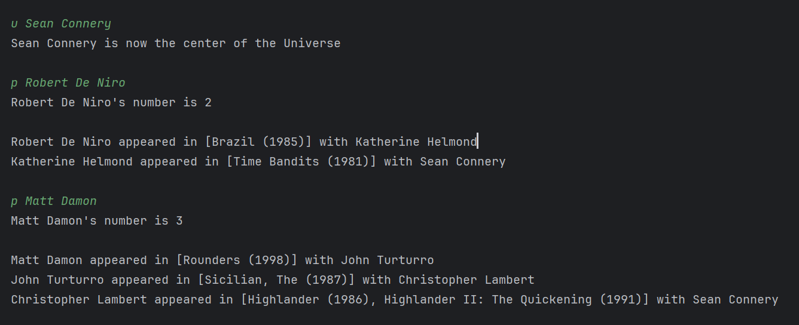

# Kevin Bacon Game

## Overview

This game uses a graph of actors and movies to find the shortest path between two actors through shared movie appearances. The program leverages graph algorithms, including breadth-first search (BFS), to analyze connections and provide various statistics, such as average separation and degree of actors.

---

## Key Features

### Graph Construction
- **Adjacency Map Representation:** Represents the network of actors and movies, where actors are vertices and edges are labeled with sets of shared movies.
- **File Parsing:** Builds the graph efficiently from datasets of movies, actors, and their associations.

### Game Mechanics
- **Dynamic Center Selection:** Allows users to choose any actor as the center of the acting universe, generating a shortest path tree from that actor.
- **Shortest Path Queries:** Finds and displays the shortest path from any actor to the center.
- **Separation Analysis:** Calculates the average separation and identifies the number of connected actors to the center.
- **Degree Analysis:** Lists the actors with the most costars.

### Graph Algorithms
- **Breadth-First Search (BFS):** Creates a shortest-path tree from the selected center to all reachable actors.
- **Path Reconstruction:** Traces the shortest path from a given actor back to the center using the BFS tree.
- **Disconnected Actors Detection:** Identifies actors not connected to the current center.
- **Average Separation Calculation:** Computes the average distance of connected actors to the center using recursive depth-first traversal.

---

## How It Works

1. **Graph Setup:**
   - Input: Three datasets (`movies.txt`, `actors.txt`, `movie-actors.txt`) containing movie titles, actor names, and their associations.
   - Output: A graph representing actors and their shared movies.

2. **Game Interaction:**
   - **Center Selection:** Choose an actor as the center of the universe using the `u <name>` command.
   - **Path Queries:** Find the shortest path to the center from another actor using `p <name>`.
   - **Analysis Commands:**
     - `a`: Calculate the average separation of connected actors.
     - `s`: Count the number of actors connected to the center.
     - `d`: Display the top 5 actors with the most costars.
     - `l`: List the top 5 actors with the lowest average separation.

3. **Output:**
   - Provides paths, analysis results, and statistics based on user queries.

---

## Enjoy!

---

## Acknowledgments

Developed as part of the Dartmouth CS curriculum, Winter 2024.

---

## License

This project is distributed under the MIT License. Refer to the LICENSE file for detailed terms and conditions.

